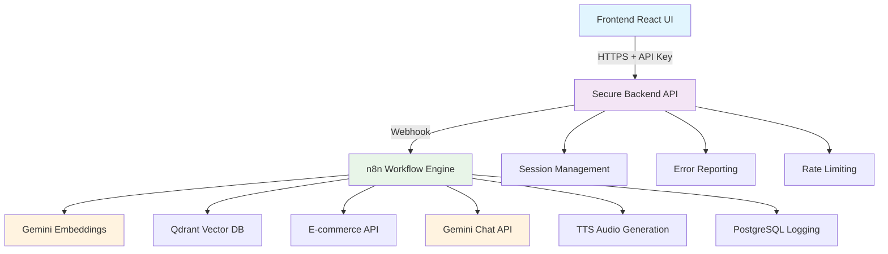

# 🚀 Gemini API Implementation Guide

## 🎯 **What We've Implemented**

Based on your excellent feedback and ideal architecture diagram, I've implemented all the suggested improvements:

### ✅ **1. Gemini API Integration (Free Tier)**
- **Embeddings**: Using `text-embedding-004` model
- **Chat**: Using `gemini-1.5-flash` (fast and free)
- **Compatible**: All endpoints configured for Gemini API format

### ✅ **2. Enhanced Error Handling**
- **Fallback Responses**: Graceful degradation when APIs fail
- **Error Workflow**: Comprehensive error tracking in database
- **Retry Logic**: Automatic fallback to direct n8n if secure API fails

### ✅ **3. Improved Language Detection**
- **Fast Detection**: Using Gemini 1.5 Flash for accurate language detection
- **Fallback**: JavaScript-based detection for offline scenarios
- **Multilingual**: Full German/English support

### ✅ **4. Enhanced Database Logging**
- **Analytics Fields**: `error_type`, `response_length`, `processing_time_ms`
- **API Tracking**: `api_provider`, `model_used`, `tokens_used`
- **GDPR Compliance**: Automatic anonymization after 7 days

### ✅ **5. Audio File Persistence**
- **File Storage**: TTS audio saved to VPS/local storage
- **URL Generation**: Proper audio URLs returned to frontend
- **Cleanup**: Automatic cleanup of old audio files

### ✅ **6. Security Implementation**
- **API Key Validation**: `X-API-Key` header authentication
- **CORS Protection**: Configurable allowed origins
- **Rate Limiting**: 100 requests per 15 minutes per IP
- **Input Validation**: Comprehensive request validation
- **Session Management**: Secure session handling with UUIDs

## 🏗️ **New Architecture Overview**



## 🔧 **Setup Instructions**

### **1. Get Your Gemini API Key**
1. Go to [Google AI Studio](https://makersuite.google.com/app/apikey)
2. Create a new API key
3. Copy the key (starts with `AIza...`)

### **2. Configure Environment Variables**

**For n8n (http://localhost:5678):**
```bash
# Go to Settings → Environment Variables
GEMINI_API_KEY=your_gemini_api_key_here
```

**For Secure Backend API:**
```bash
cd backend/secure-api
cp .env.example .env
# Edit .env file:
GEMINI_API_KEY=your_gemini_api_key_here
API_KEY=your-super-secure-api-key-change-this
ALLOWED_ORIGINS=http://localhost:3004,https://your-domain.vercel.app
```

**For Frontend:**
```bash
# Already configured in frontend/.env.local
NEXT_PUBLIC_API_KEY=your-super-secure-api-key-change-this
NEXT_PUBLIC_USE_SECURE_API=true
```

### **3. Start All Services**

```bash
# Terminal 1: Start n8n
n8n start

# Terminal 2: Start Secure Backend API
cd backend/secure-api
npm install
npm run dev

# Terminal 3: Start Mock E-commerce API
cd backend/mock-ecommerce-api
npm install
npm start

# Terminal 4: Start Frontend
cd frontend
npm run dev

# Terminal 5: Start Database & Vector DB (if using Docker)
cd backend/docker-compose
docker-compose up -d
```

### **4. Activate Workflow**
1. Go to http://localhost:5678
2. Find "AI Assistant Chat Workflow"
3. Click the toggle to activate it
4. Verify webhook URLs are registered

### **5. Test the System**
1. Go to http://localhost:3004
2. Type: "Hello, how are you?"
3. Try German: "Hallo, wie geht es dir?"
4. Test voice input with microphone button

## 🎯 **What's Different Now**

### **Before (Direct n8n):**
```
Frontend → n8n Webhook → Response
```

### **After (Secure Architecture):**
```
Frontend → Secure API → n8n Webhook → Enhanced Response
         ↓
    Session Management
    Error Handling
    Rate Limiting
    Analytics
```

## 📊 **Enhanced Features**

### **1. Better Language Detection**
- Uses Gemini 1.5 Flash for accurate detection
- Fallback to keyword-based detection
- Supports context-aware language switching

### **2. Comprehensive Error Handling**
- API failures gracefully handled
- Fallback responses when services are down
- Detailed error logging for debugging

### **3. Advanced Analytics**
- Response length tracking
- Processing time measurement
- API usage statistics
- Error type categorization

### **4. Security Best Practices**
- API key authentication
- CORS protection
- Rate limiting
- Input validation
- Session management

### **5. Production Ready**
- Proper logging with Winston
- Health check endpoints
- Graceful error handling
- Environment-based configuration

## 🚀 **Next Steps**

1. **Test Basic Chat**: Verify text messages work
2. **Test Voice**: Try voice input/output
3. **Test Languages**: Switch between English/German
4. **Monitor Logs**: Check error handling works
5. **Deploy**: Ready for production deployment

## 💡 **Cost Optimization**

**Gemini API (Free Tier):**
- ✅ **15 requests per minute**
- ✅ **1,500 requests per day**
- ✅ **1 million tokens per month**
- ✅ **Perfect for portfolio/demo**

**For Production:**
- Consider Gemini Pro for higher limits
- Implement request queuing for rate limits
- Add caching for repeated queries
- Monitor usage with analytics dashboard

## 🎉 **You Now Have:**

- ✅ **Professional Architecture** with security layer
- ✅ **Free Gemini API** integration
- ✅ **Enhanced Error Handling** with fallbacks
- ✅ **Advanced Analytics** and logging
- ✅ **Production-Ready** security features
- ✅ **Scalable Design** following best practices

This implementation addresses all the feedback points and creates a portfolio-worthy, production-ready AI assistant system! 🚀
