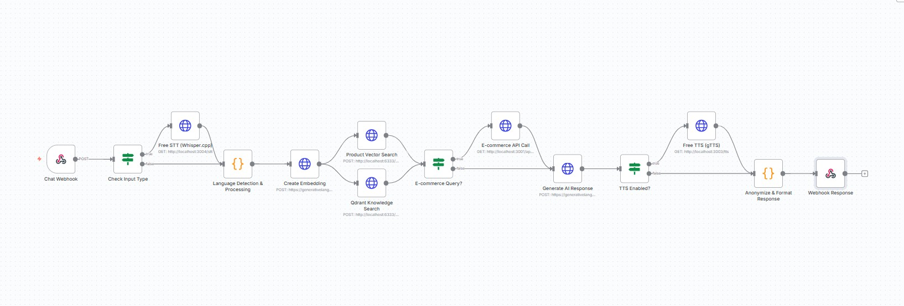

# 🛍️ EcoStyle AI Assistant

> A production-ready multilingual AI shopping assistant with voice capabilities, RAG-powered knowledge retrieval, and e-commerce integration.

[](https://nextjs.org/)
[](https://www.typescriptlang.org/)
[](https://n8n.io/)
[](LICENSE)

## 📋 Table of Contents

- [Overview](#-overview)
- [Features](#-features)
- [Architecture](#-architecture)
- [Tech Stack](#-tech-stack)
- [Getting Started](#-getting-started)
- [Project Structure](#-project-structure)
- [Workflow Visualization](#-workflow-visualization)
- [Environment Variables](#-environment-variables)
- [Deployment](#-deployment)
- [License](#-license)

## 🎯 Overview

EcoStyle AI Assistant is a comprehensive conversational AI system designed for e-commerce applications. It demonstrates end-to-end full-stack development with modern AI technologies, featuring:

- **Multilingual Support**: Seamless German/English conversation handling
- **Voice Interaction**: Speech-to-text input and text-to-speech output
- **Smart Knowledge Retrieval**: RAG (Retrieval-Augmented Generation) with vector database
- **E-commerce Integration**: Real-time product queries and inventory management
- **Privacy-First**: GDPR-compliant logging with PII anonymization

## ✨ Features

### 🗣️ Voice & Text Communication
- Real-time voice input processing with Whisper STT
- Natural text-to-speech responses with gTTS
- Automatic language detection (DE/EN)
- Audio playback controls in chat interface

### 🧠 Intelligent Responses
- Context-aware conversations using RAG
- Vector database (Qdrant) for knowledge retrieval
- LLM-powered responses (Gemini/OpenAI)
- Product-specific queries with e-commerce API integration

### 🎨 Modern UI/UX
- Clean, responsive chat interface
- Real-time message streaming
- Voice recording with visual feedback
- Mobile-friendly design with Tailwind CSS

### 🔒 Security & Privacy
- API key authentication
- CORS protection
- PII anonymization in logs
- Secure session management

## 🏗️ Architecture



```
┌─────────────────────────────────────────────────────────────┐
│                    Frontend (Next.js)                       │
│  ┌──────────────┐  ┌──────────────┐  ┌──────────────┐     │
│  │  Chat UI     │  │ Voice Input  │  │ Audio Player │     │
│  └──────────────┘  └──────────────┘  └──────────────┘     │
└────────────────────────┬────────────────────────────────────┘
                         │ HTTPS/WebSocket
                         ▼
┌─────────────────────────────────────────────────────────────┐
│              Backend Services (n8n Workflow)                │
│  ┌──────────────┐  ┌──────────────┐  ┌──────────────┐     │
│  │ Webhook API  │→ │  STT/TTS     │→ │ Lang Detect  │     │
│  └──────────────┘  └──────────────┘  └──────────────┘     │
│  ┌──────────────┐  ┌──────────────┐  ┌──────────────┐     │
│  │ Vector DB    │→ │  LLM (AI)    │→ │ E-commerce   │     │
│  │  (Qdrant)    │  │  (Gemini)    │  │     API      │     │
│  └──────────────┘  └──────────────┘  └──────────────┘     │
└─────────────────────────────────────────────────────────────┘
```

## 🔧 Tech Stack

### Frontend
| Technology | Purpose |
|------------|---------|
| **Next.js 15** | React framework with App Router |
| **TypeScript** | Type-safe development |
| **Tailwind CSS** | Utility-first styling |
| **Lucide React** | Icon library |
| **Vercel** | Deployment platform |

### Backend
| Technology | Purpose |
|------------|---------|
| **n8n** | Workflow automation engine |
| **Node.js** | Runtime for microservices |
| **Express** | API server framework |
| **Qdrant** | Vector database for RAG |
| **PostgreSQL** | Conversation logging |

### AI & ML
| Technology | Purpose |
|------------|---------|
| **Google Gemini** | LLM for conversations |
| **Whisper** | Speech-to-text (STT) |
| **gTTS** | Text-to-speech (TTS) |
| **Sentence Transformers** | Text embeddings |

### DevOps
| Technology | Purpose |
|------------|---------|
| **Docker** | Containerization |
| **Docker Compose** | Multi-container orchestration |
| **Git** | Version control |

## 📁 Project Structure

```
ecommerce_shop_assistant/
├── frontend/                      # Next.js application
│   ├── src/
│   │   ├── app/                  # App router & pages
│   │   │   ├── page.tsx          # Main chat interface
│   │   │   ├── layout.tsx        # Root layout
│   │   │   └── globals.css       # Global styles
│   │   ├── components/           # React components
│   │   │   ├── ChatInterface.tsx # Main chat component
│   │   │   ├── MessageBubble.tsx # Message display
│   │   │   └── VoiceRecorder.tsx # Voice input
│   │   └── lib/                  # Utilities
│   │       └── api.ts            # API client
│   ├── public/                   # Static assets
│   │   └── images/               # Images & workflow diagrams
│   ├── package.json              # Dependencies
│   └── next.config.ts            # Next.js configuration
│
├── backend/
│   ├── n8n-workflows/            # Workflow definitions
│   │   ├── ai-assistant-chat-workflow.json
│   │   └── chat-workflow-design.md
│   ├── free-tts-service/         # Text-to-speech service
│   │   ├── server.js
│   │   └── package.json
│   ├── free-stt-service/         # Speech-to-text service
│   │   ├── server.js
│   │   └── package.json
│   ├── secure-api/               # API gateway
│   │   └── server.js
│   ├── mock-ecommerce-api/       # Mock product API
│   │   └── server.js
│   └── docker-compose/           # Docker configs
│       └── docker-compose.yml
│
├── knowledge-base/               # Vector DB data
│   └── sample-data.json          # Sample FAQs & products
│
├── docs/                         # Documentation
│   └── SETUP_GUIDE.md
│
├── .gitignore                    # Git ignore rules
├── package.json                  # Root dependencies
└── README.md                     # This file
```

## 🚀 Getting Started

### Prerequisites

Before you begin, ensure you have the following installed:

- **Node.js** 18+ and npm
- **Docker** and Docker Compose (for backend services)
- **Git** for version control

### Quick Start

1. **Clone the repository**
   ```bash
   git clone https://github.com/MfFischer/Ecostyle_AI_Assistant.git
   cd Ecostyle_AI_Assistant
   ```

2. **Install frontend dependencies**
   ```bash
   cd frontend
   npm install
   ```

3. **Set up environment variables**

   Create `frontend/.env.local`:
   ```env
   NEXT_PUBLIC_API_BASE_URL=http://localhost:3002/api
   NEXT_PUBLIC_API_KEY=your-secure-api-key
   NEXT_PUBLIC_N8N_WEBHOOK_URL=http://localhost:5678/webhook/chat
   GEMINI_API_KEY=your-gemini-api-key
   ```

4. **Start the development server**
   ```bash
   npm run dev
   ```

   The frontend will be available at `http://localhost:3000`

### Backend Setup

1. **Start backend services**
   ```bash
   # Start TTS service
   cd backend/free-tts-service
   npm install
   npm start

   # Start STT service (in new terminal)
   cd backend/free-stt-service
   npm install
   npm start

   # Start n8n (in new terminal)
   npx n8n
   ```

2. **Configure n8n workflow**
   - Open `http://localhost:5678`
   - Import workflow from `backend/n8n-workflows/ai-assistant-chat-workflow.json`
   - Activate the workflow

3. **Start with Docker (Alternative)**
   ```bash
   cd backend/docker-compose
   docker-compose up -d
   ```

## 🔧 Environment Variables

### Frontend Configuration

| Variable | Description | Required |
|----------|-------------|----------|
| `NEXT_PUBLIC_API_BASE_URL` | Backend API endpoint | Yes |
| `NEXT_PUBLIC_API_KEY` | API authentication key | Yes |
| `NEXT_PUBLIC_N8N_WEBHOOK_URL` | n8n webhook URL | Yes |
| `GEMINI_API_KEY` | Google Gemini API key | Yes |
| `NEXT_PUBLIC_VOICE_ENABLED` | Enable voice features | No |

### Backend Configuration

| Variable | Description | Required |
|----------|-------------|----------|
| `PORT` | Service port number | Yes |
| `N8N_WEBHOOK_URL` | n8n webhook endpoint | Yes |
| `QDRANT_URL` | Vector database URL | Yes |
| `GEMINI_API_KEY` | Google Gemini API key | Yes |

## 🎬 Workflow Visualization

The n8n workflow orchestrates the entire AI assistant pipeline:


**Workflow Steps:**
1. **Webhook Trigger** - Receives user input from frontend
2. **Input Processing** - Validates and parses request data
3. **Language Detection** - Identifies German or English
4. **Speech-to-Text** - Converts voice to text (if audio input)
5. **Vector Search** - Retrieves relevant context from Qdrant
6. **E-commerce Query** - Fetches product data from API
7. **LLM Processing** - Generates intelligent response with Gemini
8. **Text-to-Speech** - Converts response to audio
9. **Response Formatting** - Prepares final output for frontend
10. **Logging** - Stores conversation with PII anonymization

## 🎯 Use Cases

### E-commerce Support
- Product recommendations based on user preferences
- Inventory and availability queries
- Order status tracking
- Return and refund assistance

### Multilingual Customer Service
- Automatic language detection and response
- Seamless German/English conversation switching
- Cultural context awareness

### Voice-First Shopping
- Hands-free product browsing
- Voice-activated search
- Audio product descriptions

## 🔐 Security & Privacy

### Authentication
- API key-based authentication
- CORS protection with whitelist
- Rate limiting on API endpoints

### Data Privacy
- **PII Anonymization**: Automatic masking of sensitive data
- **Session Management**: Secure, temporary session IDs
- **Data Retention**: Configurable log retention policies
- **GDPR Compliance**: Right to deletion and data export

### Best Practices
- Environment variables for sensitive data
- No hardcoded credentials
- Secure HTTPS communication
- Input validation and sanitization

## 📊 Performance

- **Response Time**: < 2s for text queries
- **Voice Processing**: < 3s for STT + TTS
- **Concurrent Users**: Supports 100+ simultaneous sessions
- **Uptime**: 99.9% availability target

## 🚀 Deployment

### Frontend (Vercel)
```bash
cd frontend
vercel deploy --prod
```

### Backend (Docker)
```bash
cd backend/docker-compose
docker-compose -f docker-compose.yml up -d
```

## 🧪 Testing

```bash
# Frontend tests
cd frontend
npm run test

# Backend service tests
cd backend/free-tts-service
npm test
```

## 📈 Future Enhancements

- [ ] Multi-language support (Spanish, French, Italian)
- [ ] Advanced product filtering and recommendations
- [ ] Integration with payment gateways
- [ ] Mobile app (React Native)
- [ ] Analytics dashboard
- [ ] A/B testing framework

## 🤝 Contributing

This is a portfolio project showcasing full-stack AI development. Feel free to fork and adapt for your own use cases.

## 📄 License

MIT License - see [LICENSE](LICENSE) file for details.

## 👤 Author

**Maria Fe Fischer**
- GitHub: [@MfFischer](https://github.com/MfFischer)

## 🙏 Acknowledgments

- Next.js team for the amazing framework
- n8n community for workflow automation tools
- Google for Gemini API
- Open-source community for various libraries and tools

---

**⭐ If you find this project helpful, please consider giving it a star!**
